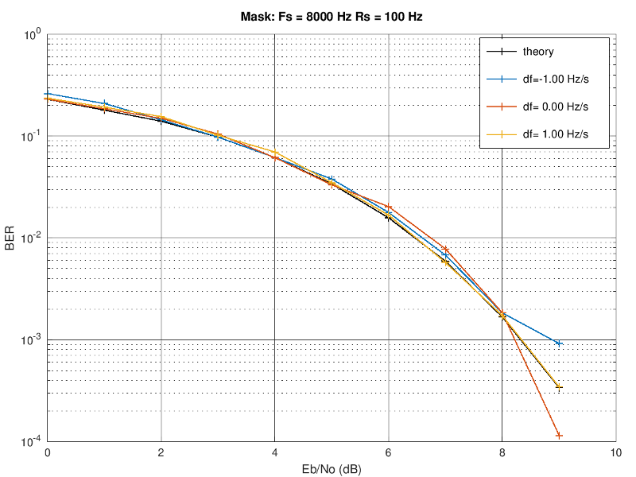

# README_fsk

A FSK modem with a non-coherent demodulator.  Performance is within a fraction of a dB of ideal.  The demodulator automagically estimates the tone frequencies and tracks frequency drift.

Here is a typical Bit Error Rate (BER) versus Eb/No curve:



Note how close the theory line is to measured performance.

This modem can demodulate FSK signals that sound like [this sample](doc/lockdown_3s.wav); and is used to receive images from the [edge of space](https://github.com/projecthorus/wenet):


## Credits

The Octave version of the modem was developed by David Rowe.  Brady O'Brien ported the modem to C, and wrote the C/Octave tests.  The modem is being maintained by David Rowe.

## Quickstart

1. Build codec2:
   ```
   $ cd codec2 && mkdir build_linux && cmake .. && make
   ```

1. Generate 1000 test bits, modulate them using 2FSK using a 8000 Hz sample rate, 100 bits/s, play on your sound card:
   ```    
   $ cd ~/codec2/build_linux/src
   $ /fsk_get_test_bits - 1000 | ./fsk_mod 2 8000 100 1200 1200 - - | aplay -f S16_LE
   ```
    The low tone frequency is 1200Hz, and the upper tone 1200 + 1200 = 2400Hz.

1. Add the demodulator and measure the bit error rate over 10,000 bits of 100 bit/s 2FSK:
   ```
   $ ./fsk_get_test_bits - 10000 | ./fsk_mod 2 8000 100 1200 100 - - | ./fsk_demod -l 2 8000 100 - - | ./fsk_put_test_bits -
   <snip>
   [0099] BER 0.000, bits tested   9900, bit errors    0
   PASS
   ```
   We get a Bit Error Rate (BER) of 0, as there is no channel noise to induce bit errors.
   
1. Same thing but this time with 4FSK, and less verbose output:
   ```
   $ ./fsk_get_test_bits - 10000 | ./fsk_mod 4 8000 100 1200 100 - - | ./fsk_demod -l 4 8000 100 - - | ./fsk_put_test_bits -q -
   <snip>
   [0099] BER 0.000, bits tested   9900, bit errors    0
   PASS
   ```

1. Lets add some channel noise:
   ```
   $ ./fsk_get_test_bits - 10000 | ./fsk_mod 2 8000 100 1200 100 - - | ./cohpsk_ch - - -26 --Fs 8000 | ./fsk_demod -l 2 8000 100 - - | ./fsk_put_test_bits -b 0.015 -
   <snip>
   SNR3k(dB): -5.76 C/No: 29.0 PAPR:  3.0 
   [0099] BER 0.010, bits tested   9900, bit errors  103
   PASS
   ```
   The cohpsk_ch utility takes the FSK modulator signal, and adds calibrated noise to it (the -26 value specifies the noise).  Try changing the noise level, and note how the Bit Error Rate (BER) changes.  The BER is 0.01, which is right on theory for this sort of FSK demodulator at this SNR (2FSK non-coherent demodulator Eb/No=9dB).  

   The SNR is calculated using the signal power divided by the noise power in 3000 Hz.  The C/No value is the same thing, but uses a noise bandwidth of 1 Hz.  There is less noise power when you look at just 1Hz, so C/No is higher. Peak to Average Power ratio (PAPR) is 3dB as a FSK signal is just a single sine wave, and a sine wave peak is 3dB higher than it's average.

1. You can visualise the C modem operation with a companion python script, for example:
   ```
   ./fsk_get_test_bits - 10000 | ./fsk_mod -p 10 4 8000 400 400 400 - - | ./fsk_demod -p 10 -t1 4 8000 400 - /dev/null 2>stats.txt
   python ../../octave/plot_fsk_demod_stats.py stats.txt
   ```

1. FSK modem C files in ```codec2/src```:

   | File | Description |
   | ---  | --- |
   | fsk.c/fsk.h | Core FSK modem library |
   | fsk_mod.c | command line modulator |
   | fsk_demod.c | command line demodulator |
   | fsk_get_test_bits.c | source of test bits |
   | fsk_put_test_bits.c | test bit sync, counts bit errors and packet errors |
   | fsk_mod_ext_vco.c | modulator that uses an external FSK oscillator |

1. GNU Octave files in ```codec2/octave```:

   | File | Description |
   | ---  | --- |
   | fsk_lib.m | Core FSK modem library |
   | fsk_lib_demo.m | A demonstration of fsk_lib, runs a single point BER test |
   | fsk_horus.m | Project Horus High Altitude Balloon (HAB) FSK demodulator |
   | fsk_horus_stream.m | Real time application for Project Horus |
   | fsk_lock_down.m | simulations to support the "lock down" waveform |
   | tfsk.m | automated test that compares the C and Octave versions of the modem |
   
   You can run many of them from the Octave command line:
   ```
   $ octave --no-gui
   octave:1> fsk_lib_demo
   ```

1. A suite of automated ctests that exercise the C and Octave code:
   ```
   $ cd ~/codec2/build_linux
   $ ctest -R test_fsk
   1/9 Test #39: test_fsk_lib ......................   Passed    3.37 sec
   2/9 Test #40: test_fsk_horus ....................   Passed    4.60 sec
   3/9 Test #41: test_fsk_modem_octave_port ........   Passed    4.17 sec
   4/9 Test #42: test_fsk_modem_mod_demod ..........   Passed    0.06 sec
   5/9 Test #43: test_fsk_2fsk_ber .................   Passed    0.24 sec
   6/9 Test #44: test_fsk_4fsk_ber .................   Passed    0.12 sec
   7/9 Test #45: test_fsk_4fsk_ber_negative_freq ...   Passed    0.07 sec
   8/9 Test #46: test_fsk_4fsk_lockdown ............   Passed    2.84 sec
   9/9 Test #47: test_fsk_vhf_framer ...............   Passed    0.06 sec
   ```
   These are written in ```codec2/CmakeLists.txt```, inspect them to find out how we test the modem.
   
## Further Reading

   Here are some links to projects and blog posts that use this modem:

   1. [Horus Binary](https://github.com/projecthorus/horusbinary) High Altitude Balloon (HAB) telemetry protocol, 3 second updates, works at 7dB lower SNR that RTTY.
   1. [Testing HAB Telemetry, Horus binary waveform](http://www.rowetel.com/?p=5906)
   1. A really useful reference on a variety of modulation techniques from [Atlanta DSP](http://www.atlantarf.com/FSK_Modulation.php).  I keep this handy when experimenting with modems.
   1. The [RTTY modem project](http://www.rowetel.com/?p=4629) that kicked off the FSK modem work.
   1. [Wenet](https://github.com/projecthorus/wenet) - high speed SSTV images from balloons at the edge of space
   1. [Wenet High speed SSTV images](http://www.rowetel.com/?p=5344)
   1. [FreeDV 2400A and 2400B](http://www.rowetel.com/?p=5219), digital speech for VHF/UHF radios.
   1. [HF FSK with Rpitx](http://www.rowetel.com/?p=6317)
   
